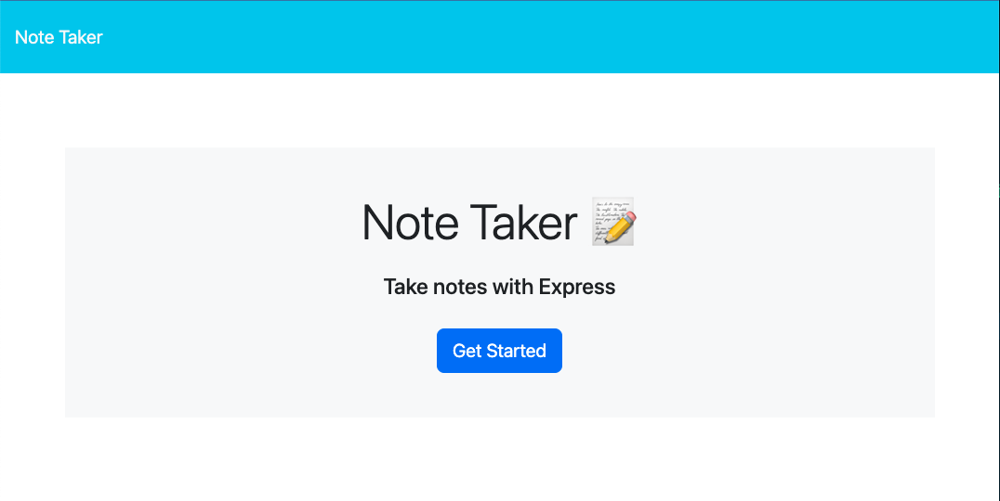
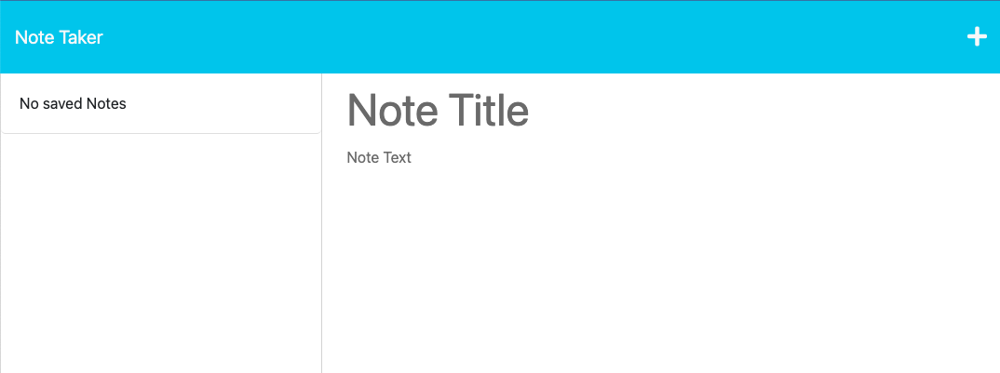
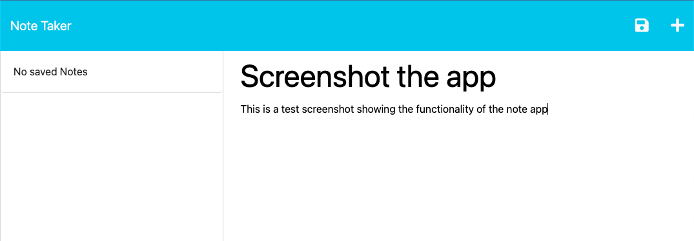
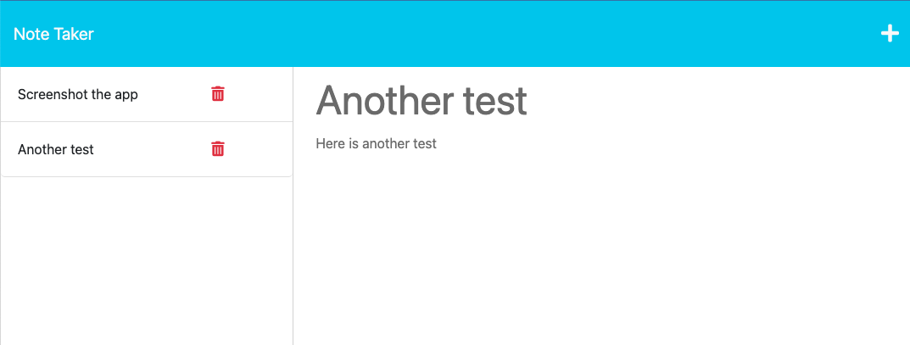

# Note Taking Application

## Description

I was motivated to create this application as a simple, easy and efficient way to keep track of notes and tasks. I built this because I wanted an app that was integrated into the browser, that I could take notes on, without leaving to a different app. It solves the problem of being able to conveniently take notes and access them on any other device with internet. I learned a lot more about Node JS and more importantly, routing within Express.JS.  

## Installation

The steps to install my project are as follows:

- Clone or fork my code from GitHub
- Install the required dependencies (Express & UUID) via "npm init" in the command line
- Run "node server.js" in the command line

## Usage

Here is a link to the deployed application:

Here are a few screenshots of the app functionality:

## License

MIT License

Copyright (c) 2023 Erich Z.

Permission is hereby granted, free of charge, to any person obtaining a copy of this software and associated documentation files (the "Software"), to deal in the Software without restriction, including without limitation the rights to use, copy, modify, merge, publish, distribute, sublicense, and/or sell copies of the Software, and to permit persons to whom the Software is furnished to do so, subject to the following conditions:

The above copyright notice and this permission notice shall be included in all copies or substantial portions of the Software.

THE SOFTWARE IS PROVIDED "AS IS", WITHOUT WARRANTY OF ANY KIND, EXPRESS OR IMPLIED, INCLUDING BUT NOT LIMITED TO THE WARRANTIES OF MERCHANTABILITY, FITNESS FOR A PARTICULAR PURPOSE AND NONINFRINGEMENT. IN NO EVENT SHALL THE AUTHORS OR COPYRIGHT HOLDERS BE LIABLE FOR ANY CLAIM, DAMAGES OR OTHER LIABILITY, WHETHER IN AN ACTION OF CONTRACT, TORT OR OTHERWISE, ARISING FROM, OUT OF OR IN CONNECTION WITH THE SOFTWARE OR THE USE OR OTHER DEALINGS IN THE SOFTWARE.
